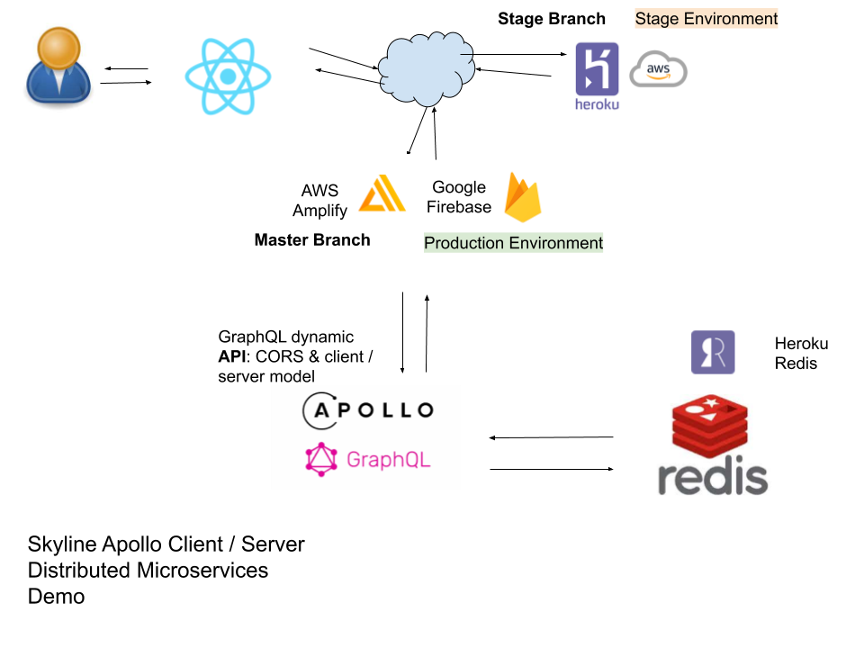

# Apolloclient Demo
Ever wonder what the difference is in price by region? This demo has fake data that will tell you! Simply line up your customer and location to see how much they spent in each region for the same product.

## Certified for use with:
* **node**: v12.18.2
* **npm**: v6.14.5
* **React**: v16.13.1

## Distributed Microservices Demo
"Apollo Client Demo" is part of a complete distributed microservices demo that has a backend running "Apollo Server Demo" found [here](https://github.com/radkin/apolloserver_demo).


## Up and Running
You will need a running instance of the apolloserver_demo before this React pure client has any data. Please remember to run the test to populate redis with data. For local laptop and a locally running instances of apolloserver there is no need to do anything else. If deploying to Heroku hard set the apolloserver setting as there is nothing hidden in a pure client (browser). What is the point in trying to hide the backend server's URL when you can find it in the client code via your browser?

### Starting and stopping
For now, when developing the following commands preferable in separate windows
on the command-line (tmux is good).

**Start**: `npm run dev`
**Stop** `ctrl-c`

## Tests
* code coverage: `npm run coverage`
* Jest/Enzyme Tests
For local laptop: `npm run test`

## Very Important!
The .env file is not tracked in github, but it needs to have the correct values
For Production to use _Firebase_ at compile time. _Amplify_ has environment variables defined in the UI while Heroku has environment variables best defined on the command-line using the CLI. **development** .env looks like this:
```bash
REACT_APP_PORTNUM='9000'
REACT_APP_APOLLO_SERVER='localhost'
REACT_APP_ENV='development'
```
**Production** looks like this:
```bash
REACT_APP_ENV='production'
REACT_APP_APOLLO_SERVER= < SUPER SECRET SERVER NAME >
```

**NOTE**: Continuous delivery via _Travis-CI_ has these environment variables defined in their UI. That is how it works with firebase and no `.env` file. It is only manual deployment using the _firebase_ CLI that requires this file or the environment variables deifined locally.

It is possible that _Amplify_ will work fine without using environment variables defined in the UI, perhaps compiling with `.env` will work. This has not been tested.

## Author
radkin@github.com (not a proper email address)
